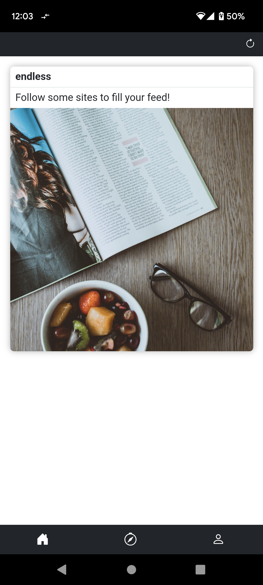
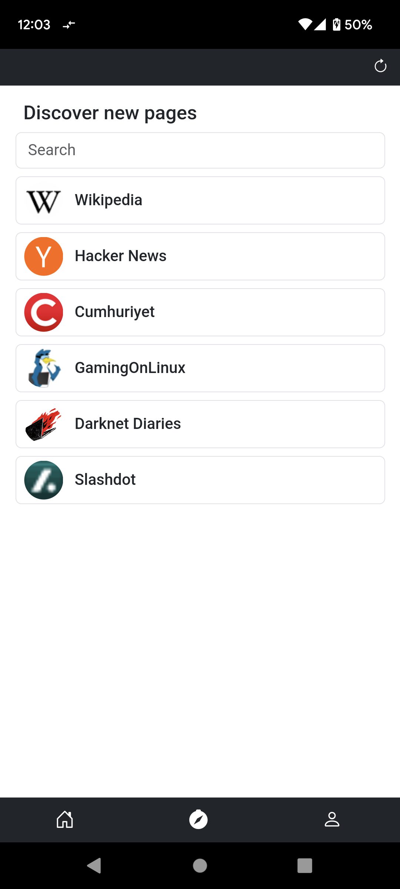
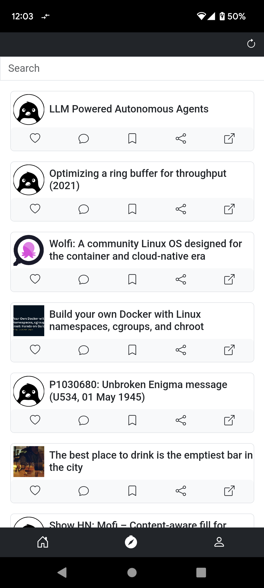
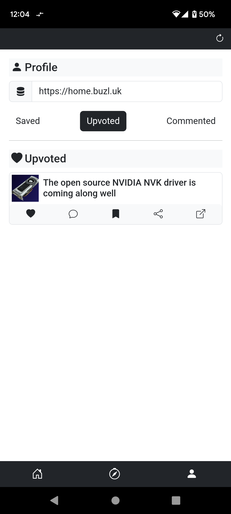

    
    <h1 align="center">Endless</h1>
    

        Unifying the social media experience
         
        

            
            
            
            
            
        

        <a href="https://github.com/kaangiray26/endless/issues">Report Bug</a>
        ·
        <a href="https://github.com/kaangiray26/endless/issues">Request Feature</a>
    

## What is Endless?
Endless is a social media curator that allows you to view all of your favorite websites in one place with a unified card-based interface. It allows for users to upvote, save and comment on posts from websites even if the website doesn't support it.

## Screenshots

    
    
    
    
    

## Installation
Download the APK from [GitHub Releases](https://github.com/kaangiray26/endless/releases) and install it.

## Features
* No account needed
* Save posts
* Upvote posts
* Comment on posts
* Remove upvotes and comments if needed
* Fuzzy search on post titles on feed

## Supported Websites
- [x] Wikipedia
- [x] Hacker News
- [x] GamingOnLinux
- [x] Cumhuriyet
- [x] Darknet Diaries
- [x] Slashdot
- [x] Quanta Magazine
- [x] Reddit
- [ ] Ars Technica
- [ ] The Onion

## Starting the server
You can use the [docker-compose.yml](server/docker-compose.yml) file to start the server.

## How to contribute?
You can contribute to Endless by adding support for new websites or by improving the existing codebase. If you want to add support for a new website, take a look at the existing extractors. Usually, each website has its own extractor with two methods inside the [extractors](https://github.com/kaangiray26/endless/tree/main/extractors) directory. If you want to improve the existing codebase, you can do so by creating a pull request.

## Extractors
Take a look at the [extractor list](list.json) below to see which websites are supported at the moment.

Prebuilt versions of the extractors are also located in the [min](https://github.com/kaangiray26/endless/tree/main/min) directory.
* For example: [Hacker News](min/hacker-news.min.js)

## Wiki
> Coming soon
